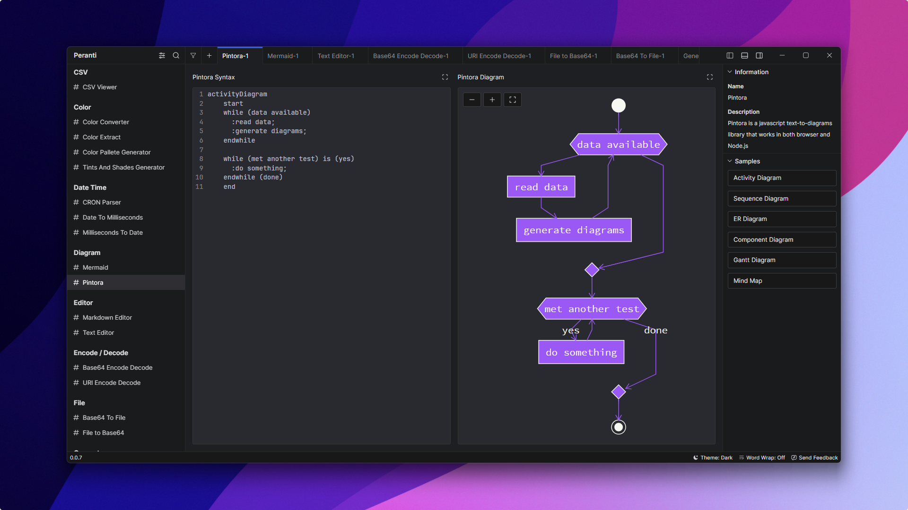
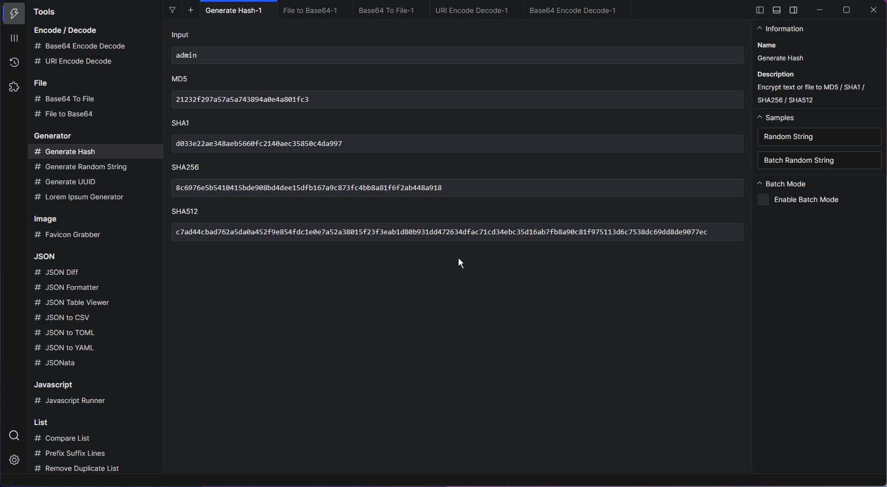
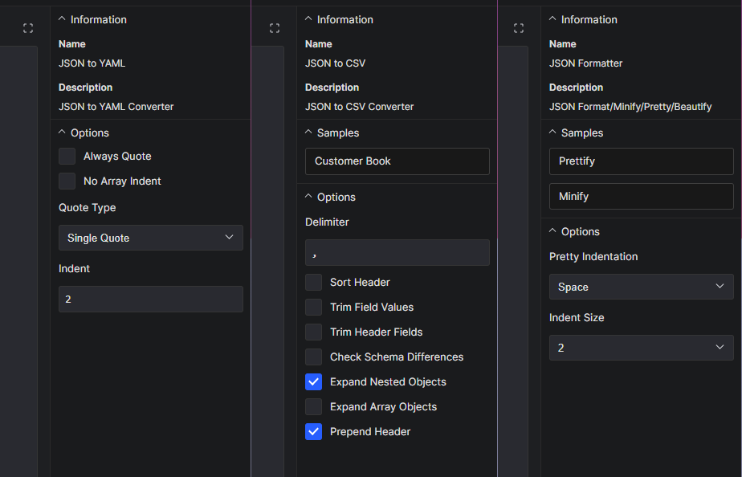
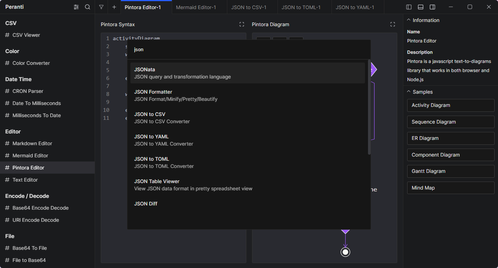

  

<h1 align="center">
  Peranti
</h1>

Next Generation Developer Toolbox

  
  
  
  

  
  

  

**Peranti** is cross-platform desktop application that contains a collection of small tools to helps developer with their common tasks, such as format or minify JSON, convert timestamps, encode or decode text, hash, and many more, without having to worry about their data privacy. It's completely offline, no data will be collected, free, and open source.

Available tools:
- CSV Viewer
- Color Converter
- Color Extract
- Color Pallete Generator
- Tints And Shades Generator
- CRON Parser
- Date to Milliseconds
- Milliseconds to Date
- Mermaid Diagram
- Pintora Diagram
- Markdown Editor
- Text Editor
- Base64 Encode / Decode
- URI Encode / Decode
- Base64 to File
- File to Base64
- Generate Random String
- Generate UUID
- Hash Generator
- Lorem Ipsum Generator
- Favicon Grabber
- JSON Compare / Diff
- JSON Formatter
- JSON Table Viewer
- JSON to CSV
- JSON to TOML
- JSON to YAML
- JSONata
- Javascript Runner
- Compare List
- Prefix Suffix List
- Remove Duplicate List
- Sort List
- Math Evaluator
- React Runner
- SQL Formatter
- SQL Minify
- SQL Where Query
- Text Case Transform
- Text Counter
- Text Escape / Unescape
- YAML to JSON
- *More tools are coming!*

# Features
## Tabs
Keep your data in place and use another tool at the same time, or open the same tool with different data at once.

  
   

## Batch Mode
Supported tools have **Batch Mode** which allows you to have multiple input and output separated by new line

  
   

## Options
Customize the tool input and output to match your preferences.

  
   

## Search
Easily find tool that you want to use.

  
   

## Settings
Customize the application appearance and other features.

  
   

