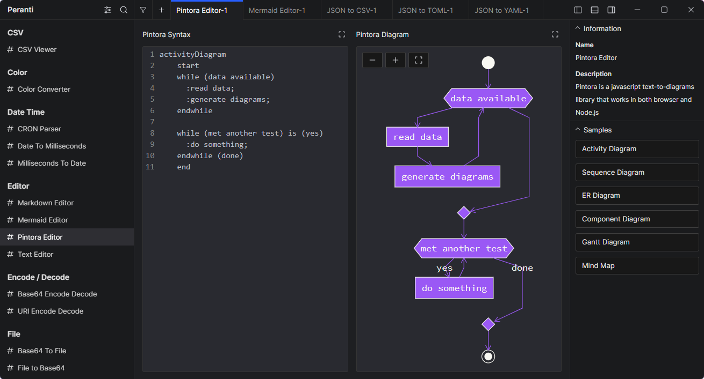
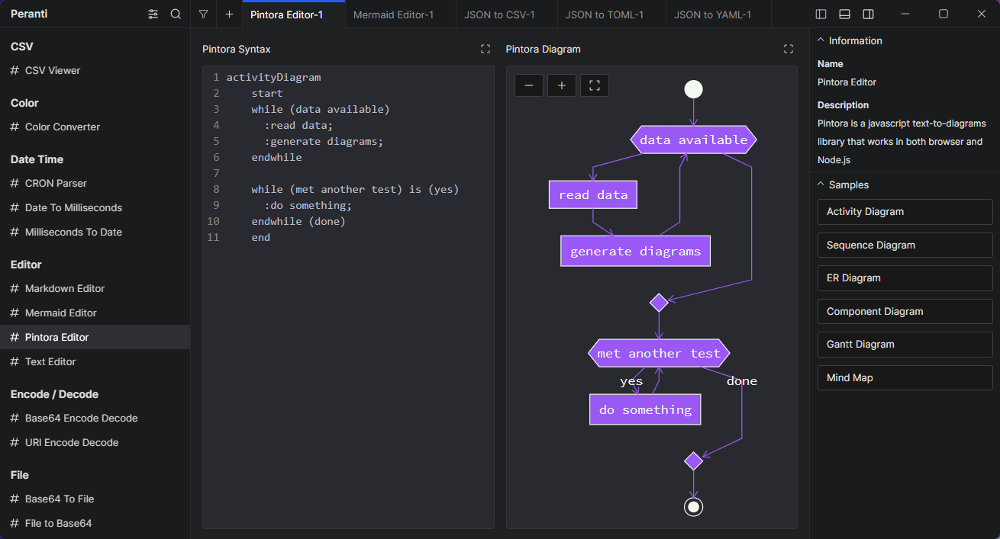
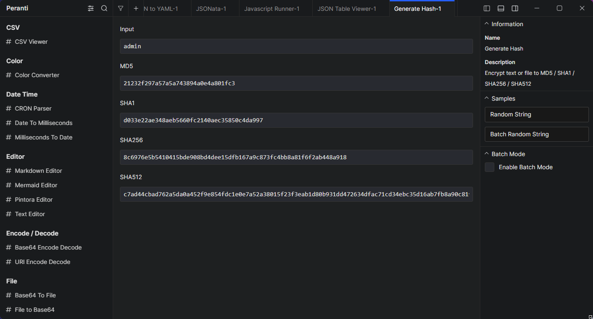
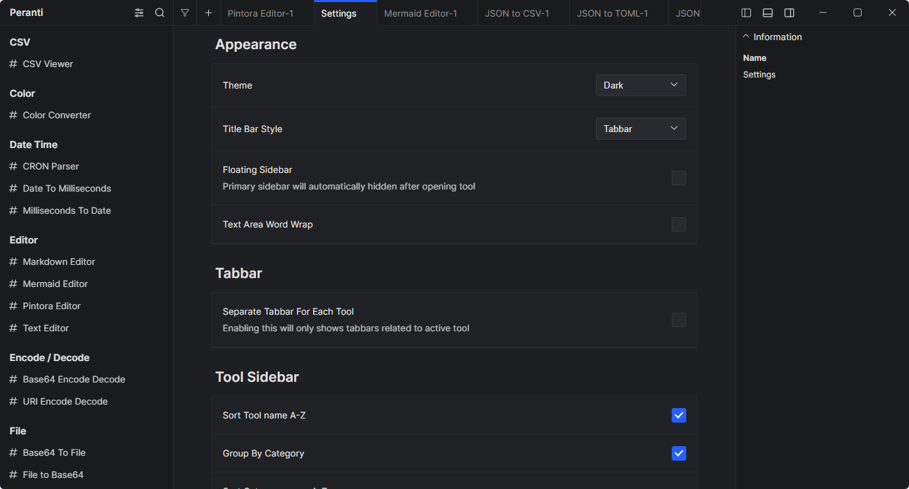

  

<h1 align="center">
  Peranti
</h1>

Next Generation Developer Toolbox

  
  
  
  

  

  
  

Peranti is a cross-platform desktop application that contains a collection of small tools to helps developer with their common tasks, such as format or minify JSON, convert timestamps, encode or decode text, hash, and many more, without having to worry about their data privacy. It's completely offline, no data will be collected, free, and open source.

Available tools:
- **JSON**: JSON Format / Minify,  JSON Diff,  JSON to CSV,  JSON to YAML,  JSONata
- **Diagram**: Mermaid, Pintora
- **Date Time**: Cron Parser, Date to Milliseconds, Milliseconda to Date
- **Color**: Color Converter
- **List**: Compare List, Prefix Suffix Lines, Remove Duplicate List
- *More tools are coming!*

# Features
## Tabs
Use tool by opening a new tab without having to clear current input.

  
   

## Batch Mode
Allows user to use the tool with multiple input separated by new line.

  
   

## Options
Customize the tool input and output to match your preferences.

  
   

## Search
Easily find tool using search function.

  
   

## Settings
Customize the application appearance and other features.

  
   

## Preset
Open tool with pre-filled inputs for quick access, save it as a preset or a new tool.
